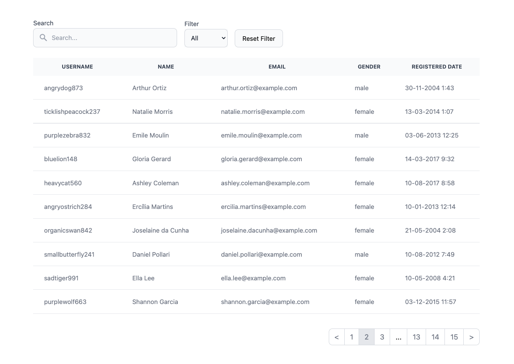

This project was bootstrapped with [VIte](https://vitejs.dev/guide/).

## Available Scripts

In the project directory, you can run:

### `yarn install`

Instal All dependencies in this project

### `yarn dev`

Runs the app in the development mode. 
Open [http://localhost:3000](http://localhost:3000) to view it in the browser.

### Link

Vite: https://vitejs.dev/guide
Tailwind CSS: https://tailwindcss.com/docs/guides/vite
RandomUser: https://randomuser.me/
